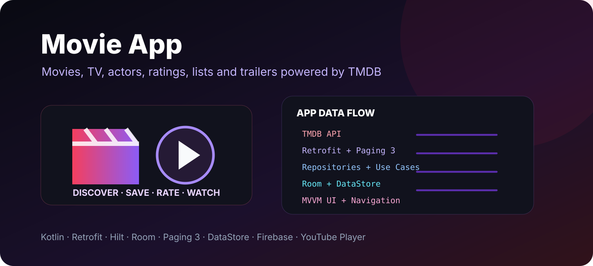

<p align="center"></p>

# Movie App

A feature-rich Android application for discovering movies, TV shows and actors through TMDB. It combines remote media data with local history and lists, supports account/session flows, and follows an MVVM-oriented architecture with repositories, use cases and dedicated UI state models.

> This repository is a fork of [Salmon-family/MovieApp](https://github.com/Salmon-family/MovieApp). See the upstream project and contributors for the original collaboration history.

## Features

- browse trending, popular, upcoming and now-streaming movies
- browse airing-today, on-the-air and top-rated TV shows
- discover movies and TV shows by genre
- browse actors and their filmography
- movie and TV details
- seasons and episode lists
- trailers through an embedded YouTube player
- reviews
- TMDB login/session flow
- account/profile information
- rate movies and TV shows
- create custom TMDB lists
- save media to custom lists
- local search history
- local watch history
- rated-media history
- search across movies, TV shows and actors
- paginated remote results

## Architecture

The codebase separates data, domain and UI responsibilities:

```
app/src/main/java/com/karrar/movieapp/
├── data/
│   ├── local/          Room + DataStore
│   ├── remote/         Retrofit services and DTOs
│   └── repository/     repository implementations and paging sources
├── domain/
│   ├── models/
│   ├── mappers/
│   └── usecases/
├── di/                 Hilt modules
├── ui/                 feature screens, view models and UI state
└── utilities/
```

Typical data flow:

```
UI -> ViewModel -> Use Case -> Repository
                         ├-> TMDB API
                         └-> Room / DataStore
```

## Tech stack

| Area | Technology |
| --- | --- |
| Language | Kotlin |
| Architecture | MVVM + repository/use-case layers |
| Networking | Retrofit + OkHttp |
| API | The Movie Database (TMDB) |
| DI | Hilt |
| Local DB | Room |
| Preferences | DataStore |
| Pagination | Paging 3 |
| Images | Picasso + Coil |
| Navigation | Android Navigation Component |
| Async/state | Coroutines + LiveData |
| UI binding | Data Binding + View Binding |
| Video | Android YouTube Player |
| Animations | Lottie |
| Monitoring | Firebase Analytics, Crashlytics and Performance |

The application targets Android API 32 and supports devices from API 21.

## TMDB integration

The app uses:

```
https://api.themoviedb.org/3/
```

Image assets are loaded from TMDB's image CDN, and authentication uses TMDB request-token/session APIs.

## Local setup

Create a `local.properties` file in the project root and add your TMDB API key:

```properties
apiKey="YOUR_TMDB_API_KEY"
```

Then open the project in Android Studio and sync Gradle.

## Build

```bash
./gradlew assembleDebug
```

To run tests:

```bash
./gradlew test
```

## Data stored locally

Room entities cover cached media categories, actors, search history, watch history and saved/watch-list related data. DataStore is used for lightweight application/session preferences.

## License

This repository includes the Apache License 2.0. See the [LICENSE](LICENSE) file for the complete terms.

## Credits

Movie and TV metadata is provided by TMDB. The original project was developed collaboratively in the upstream Salmon-family repository.
